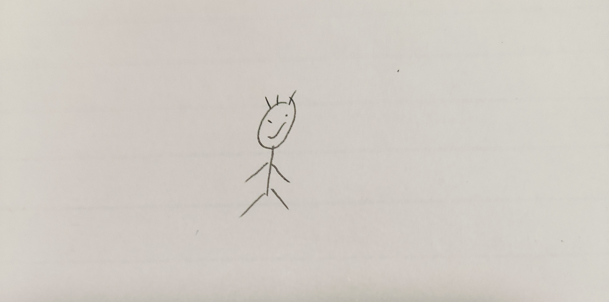

# 👋 Hi there! I'm xiaolongbao zhou

  
  
  
  ### 🎯 一个热爱编程与二次元的自动化本科生
  
  
  
  

---

## 📊 GitHub Stats

  
  
  
  
  

---

## 🚀 Tech Stack & Skills

### 💻 Programming Languages

### 🛠 Tools & Technologies

### 📚 Currently Learning

---

## 🎨 About Me

<table>
<tr>
<td valign="top" width="50%">

### 👨‍💻 Developer Info
- 🎓 **学历**: 本科自动化在读
- 💻 **专长**: Modern C++ 开发
- 🔧 **领域**: 自动化控制系统
- 📈 **目标**: 成为ros工程师

</td>
<td valign="top" width="50%">

### 🎯 Personal Interests  
- 🎬 **爱好**: 二次元文化
- 📺 **平台**: Bilibili内容创作者
- 🌟 **性格**: 开朗外向
- 😅 **日常**: 讨厌学习但热爱编程

</td>
</tr>
</table>

---

## 📱 Find me around the web

---

## 📈 Activity Graph

  
  
  

---

  
  ### 📊 Profile Views
  
  
  **⭐ If you like my projects, please give them a star! ⭐**
  

---

  

